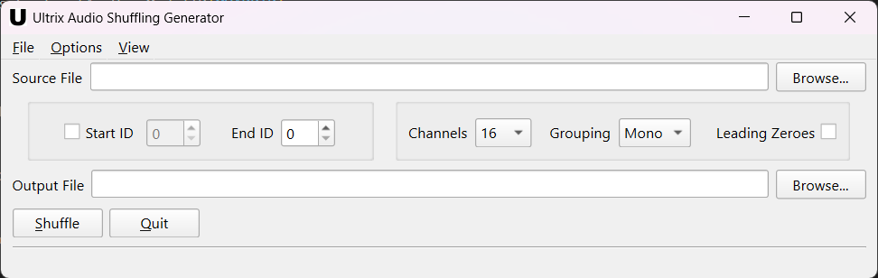

# **Audio Shuffling Generator for Ultrix Database**

This is a small application that will take an Excel export from Ross Video Ultrix or Ultricore BCS Sources tables and append audio shuffling sources.

The GUI interface is pretty straightforward. It asks for a source file, an ending index number, a number of audio channels, how you want your audio grouped, and an output filename. Once all of those are provided, just hit the `Shuffle` button and it should generate an Excel file that can be directly imported back into the Sources table in Dashboard.

  

- **Source List:** Enter or Browse to the file path of an Excel file that contains the data you wish to use. This is usually a direct export from Dashboard.
- **End Index:** Enter the index number from the ID column of the last source you want to use to generate audio sources. The status bar at the bottom will tell you the source name associated with that index number.
- **Audio Channels:** Choose the number of audio levels in your database (**2**, **4**, **8**, or **16**).
- **Audio Grouping:** Choose how you want the audio channels grouped (**Mono**, **Stereo**, **Quad**, or **Octo**)
- **Leading Zeroes** Decide if you want channel numbers 1-9 to be displayed with a leading zero (01-09)
- **Output File:** Enter or Browse to the file path you wish your output Excel file to have. This field will also automatically update based on the file path entered in the **Source List** field.

-----

## **Input Data Structure**

The source file is inteded to be an Excel file exported from the Sources table of a Ross Video Ultrix or Ultricore BCS. The application expects a `sources` worksheet and the internal data to follow the form generated by the export.